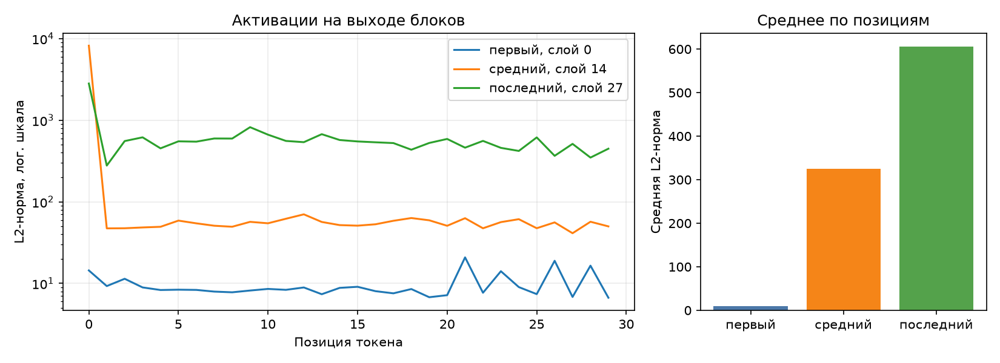

# ДЗ 2 — анатомия Qwen/Qwen3-0.6B

## Условия замера

| Условие | Значение |
|---|---|
| Платформа | Linux-7.2.4-arch1-2-x86_64-with-glibc2.44 |
| Устройство | cpu |
| dtype весов | bfloat16 |
| seq_len / batch | 256 / 1 |
| Прогонов на режим | 1, каждый в отдельном процессе |
| Метрика памяти | ru_maxrss |
| Python | 3.12.13 |
| torch | 2.14.0+cu130 |
| transformers | 5.17.0 |
| peft | 0.20.0 |
| Seed | 42 |

Запуск: `uv sync --locked`, затем `make inspect`. Модель загружается из локального кэша.
Вход для замера памяти — случайные ID токенов. KV-cache отключён во всех режимах.
Инференс: один forward без градиентов. Обучение: forward, backward и один шаг AdamW.
Для LoRA обучаются только адаптеры первого конфига. Gradient checkpointing не включён.
Единица памяти во всех таблицах — МиБ (байты / 1024²). В шаблоне курса она подписана «МБ».

## 1. Параметры модели

Блоков: 28; hidden_size: 1024; intermediate_size: 3072; словарь: 151936.
Голов Q: 16; голов K/V: 8; размер головы: 128.

| Группа | Модулей | Shape | Уникальных параметров | Доля | Общих параметров |
|---|---:|---|---:|---:|---:|
| embed | 1 | 151936×1024 | 155 582 464 | 26.10% | 0 |
| q_proj | 28 | 2048×1024 | 58 720 256 | 9.85% | 0 |
| k_proj | 28 | 1024×1024 | 29 360 128 | 4.93% | 0 |
| v_proj | 28 | 1024×1024 | 29 360 128 | 4.93% | 0 |
| o_proj | 28 | 1024×2048 | 58 720 256 | 9.85% | 0 |
| gate_proj | 28 | 3072×1024 | 88 080 384 | 14.78% | 0 |
| up_proj | 28 | 3072×1024 | 88 080 384 | 14.78% | 0 |
| down_proj | 28 | 1024×3072 | 88 080 384 | 14.78% | 0 |
| norm | 113 | 128, 1024 | 65 536 | 0.01% | 0 |
| lm_head | 1 | 151936×1024 | 0 | 0.00% | 155 582 464 |
| **Итого** | | | **596 049 920** | **100%** | |

Прямая проверка через `model.parameters()`: 596 049 920. Разница: 0.
Связывание входных и выходных весов: `tie_word_embeddings=True`.
Общий тензор учитывается один раз. Ноль в строке lm_head при связывании означает
отсутствие дополнительных весов, а не отсутствие самого выходного слоя.
Таблицы MLP широкие, поэтому занимают значительную долю параметров; большой словарь
тоже требует много весов. Нормализации содержат лишь небольшие векторы множителей.

## 2. Активации и хуки

Промпт: «Объясни, что такое MLOps, в трёх предложениях.». После шаблона чата: 30 токенов.
Хук снимает L2-норму вектора каждого токена на выходе выбранного блока.

| Блок | Индекс | Средняя норма | Максимум | Позиция максимума |
|---|---:|---:|---:|---:|
| первый | 0 | 9.675 | 20.865 | 21 |
| средний | 14 | 325.482 | 8189.664 | 0 |
| последний | 27 | 606.368 | 2815.929 | 0 |

Масштаб скрытых состояний меняется по глубине модели: каждый блок добавляет свою
поправку через residual-связь. Это не означает, что норма обязана расти на каждом слое.
Логарифмическая шкала позволяет видеть и небольшие значения, и выбросы.
По одному графику норм нельзя доказать, на какие токены направлено внимание.

Число хуков: до запуска 0, после первого 0, после второго 0. Нормы двух запусков совпали: True.

## 3. Расчёт LoRA

Для матрицы с размером out × in добавляются A размера r × in и B размера out × r.
Поэтому число новых параметров равно **r × (in + out)**. Складываем по целевым слоям.

| Конфиг | Своя формула | PEFT | Разница | Доля от базовой модели |
|---|---:|---:|---:|---:|
| r=8, q_proj+v_proj | 1 146 880 | 1 146 880 | 0 | 0.192% |
| r=16, все линейные | 10 092 544 | 10 092 544 | 0 | 1.693% |

В конфиге «все линейные» используются семь типов проекций декодер-блока.
Выходной lm_head в этот список не входит. Доли выше считаются от базовой модели,
а PEFT в консоли делит на размер модели вместе с адаптером.

- r=8, q_proj+v_proj: q_proj: 28 × 8 × (2048 + 1024); v_proj: 28 × 8 × (1024 + 1024) = 1 146 880.
- r=16, все линейные: q_proj: 28 × 16 × (2048 + 1024); k_proj: 28 × 16 × (1024 + 1024); v_proj: 28 × 16 × (1024 + 1024); o_proj: 28 × 16 × (1024 + 2048); gate_proj: 28 × 16 × (3072 + 1024); up_proj: 28 × 16 × (3072 + 1024); down_proj: 28 × 16 × (1024 + 3072) = 10 092 544.

## 4. Память

| Режим | Пик, МиБ | К инференсу | Время с загрузкой, с | PID |
|---|---:|---:|---:|---:|
| Инференс | 2525.6 | 1.00 | 10.8 | 13472 |
| Полное дообучение | 6809.3 | 2.70 | 22.4 | 13817 |
| LoRA r=8, q/v | 3291.1 | 1.30 | 16.7 | 13889 |

Сами веса занимают 1136.875 МиБ. Пики во всех режимах выше этого значения.
Следующая таблица показывает размер тензоров, посчитанный по numel × element_size.
Градиенты измерены после backward, состояния AdamW — после optimizer.step.

| Режим | Веса базы, МиБ | Градиенты, МиБ | Состояния AdamW, МиБ |
|---|---:|---:|---:|
| Инференс | 1136.875 | 0.000 | 0.000 |
| Полное дообучение | 1136.875 | 1136.875 | 2273.751 |
| LoRA r=8, q/v | 1136.875 | 4.375 | 8.750 |

При полном дообучении нужны градиенты и состояния оптимизатора для всех весов.
При LoRA — только для адаптеров; базовые веса остаются в памяти.
Кроме этих тензоров нужны активации, результаты вычислений и рабочие буферы.
Поэтому LoRA экономит память обучения, но её пик не равен только размеру адаптера.
RSS включает также Python, библиотеки и память, удерживаемую аллокатором.
Сумма в таблице тензоров не обязана равняться пику всего процесса.
PEFT может хранить адаптеры в float32, хотя база загружена в bfloat16; размеры выше
получены из реальных тензоров, а не из предположения о двух байтах на любое число.

Пик CPU измеряется через ru_maxrss за жизнь отдельного процесса, включая загрузку.
На CUDA используется max_memory_allocated с синхронизацией; на MPS — максимум
driver_allocated_memory по выборкам каждые 10 мс и на границах этапов.
Выборочный максимум MPS может пропустить очень короткий пик.
CUDA/MPS на этой машине недоступны: их выбор метрики проверен тестами с подставными
значениями API, реальные замеры здесь выполнены только на CPU.

## 5. Четыре исправленных дефекта

### 1. Хуки оставались на слоях
Было: дескрипторы хуков не сохранялись, remove() не вызывался.
Проявление: каждый вызов добавлял ещё три хука, и они удерживали словари результатов.
Исправлено: контекстный менеджер с finally снимает свои хуки. Теперь числа: 0 → 0 → 0; повторные нормы совпадают.
Отдельный тест проверяет удаление при исключении и сохранение чужого хука.

### 2. Общие веса считались дважды
Было: обход с remove_duplicate=False давал 751 632 384 параметров.
Это на 155 582 464 больше прямого подсчёта.
Исправлено: повторный id тензора помечается tied. Итог 596 049 920, разница с моделью 0.

### 3. Остаток памяти выдавался за пик; режимы смешивались
Было: память ускорителя снималась в конце после gc.collect(), а режимы запускались
в одном процессе. RSS хранит максимум за жизнь процесса, поэтому тяжёлый режим
мог завысить результат следующего режима.
Исправлено: каждый режим запускается отдельным subprocess, память отслеживается
во время работы и включает загрузку. PID и реальные пики приведены в таблице выше.
Разница full FT − inference: 4283.7 МиБ; LoRA − inference: 765.5 МиБ.

### 4. На ускорителе выбирался RSS
Было: device_allocated_bytes() для любого устройства возвращала RSS процесса.
Из-за этого подпись «аллокатор» не соответствовала измерению; память GPU могла не учитываться.
Исправлено: CPU → ru_maxrss, CUDA → max_memory_allocated, MPS → driver_allocated_memory.
Численная проверка с подставным API: при текущем расходе CUDA 10 байт и пике 90
сохраняется 90; при выборках MPS 10 → 90 → 20 сохраняется 90, а не 20.
Это тест алгоритма, не измерение реальной видеокарты.

## Источники и файлы

Числа этого запуска сохранены в report.json, сводная таблица — anatomy-worksheet.xlsx.
Условия и требования: материалы ДЗ 2 и лекция 2 из выданного архива.
- [Пик памяти CUDA](https://docs.pytorch.org/docs/stable/generated/torch.cuda.max_memory_allocated.html)
- [Память драйвера MPS](https://docs.pytorch.org/docs/stable/generated/torch.mps.driver_allocated_memory.html)
- [LoRA в PEFT](https://huggingface.co/docs/peft/package_reference/lora)
